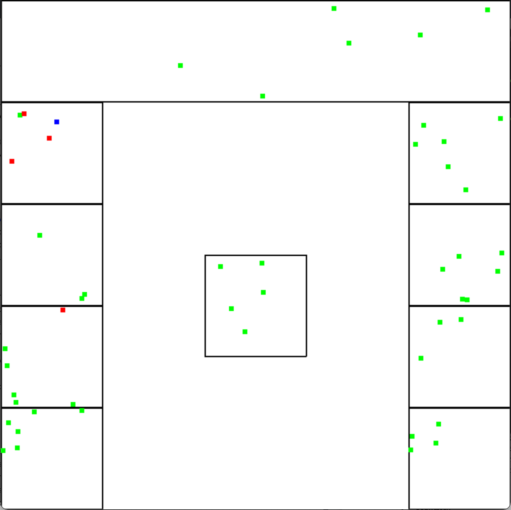

Dependacies in python

The file requires that you pip install  
hashlib  
pygame  
termcolor  
pandas  
tqdm  

To run the simulation run the coronasim.py file

The pdf report also contains gifs and is required to be opened in adobe acrobat reader
https://acrobat.adobe.com/ie/en/acrobat/pdf-reader.html

